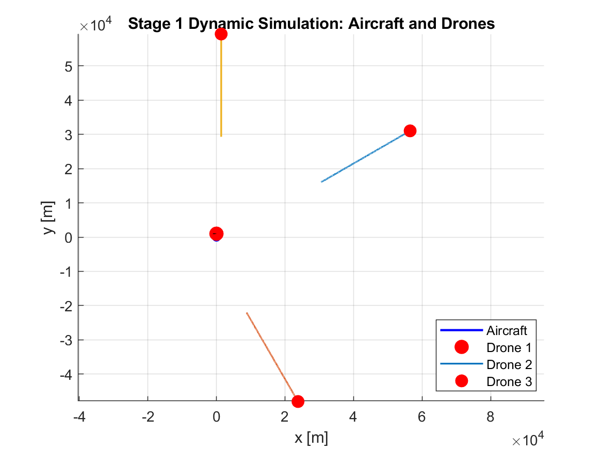
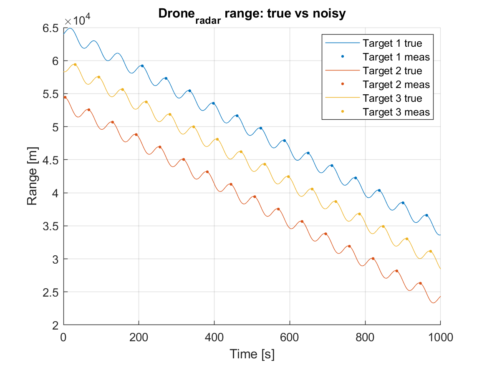
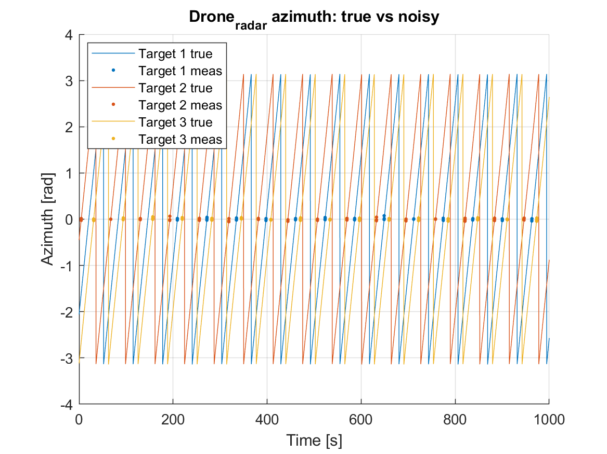
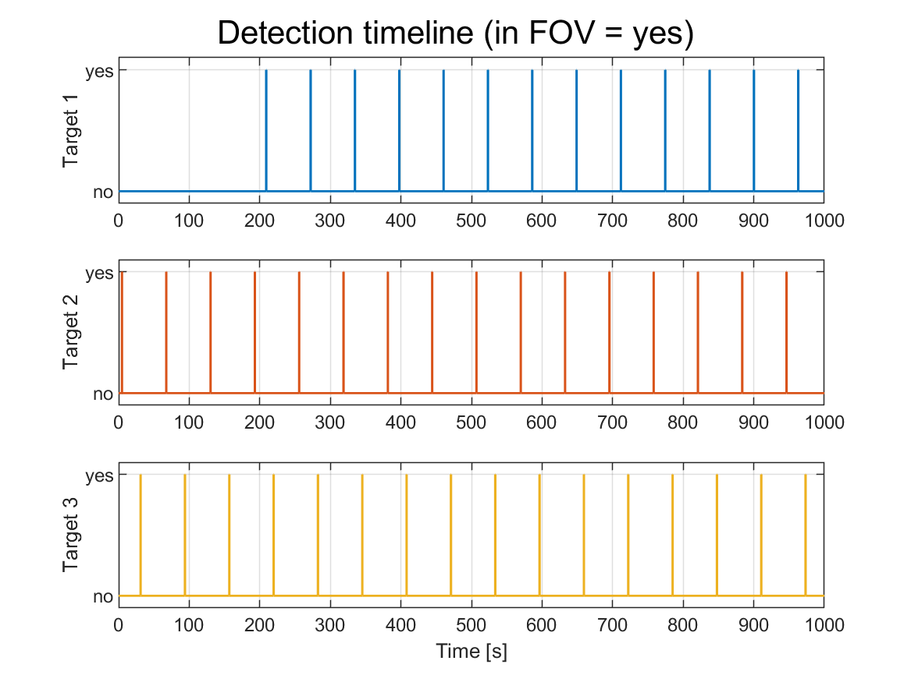
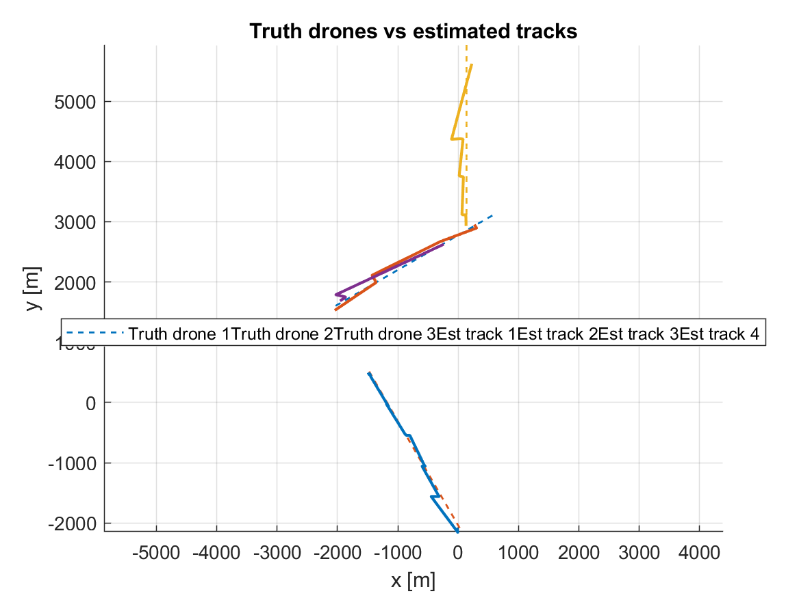

# Air to Air Tracking

MATLAB project that simulates an aircraft flying a trajectory, generates side-looking radar measurements of multiple drones, and tracks those drones using an EKF with global nearest-neighbor (GNN) association.

## Project stages
- **Stage 1**: scenario + ground-truth simulation (aircraft + drones).
- **Stage 2**: radar measurement generation (range/azimuth detections) and plots.
- **Stage 3**: tracking (EKF + data association + dynamic track birth) and plots/metrics.

## Requirements
- MATLAB (recent releases recommended).
- If you run without a desktop (headless), figures are still generated and exported by the scripts.

## How to run
From MATLAB, set the current folder to the repo root, then run:

```matlab
run('scripts/run_stage2_radar_generation.m');
run_stage2_radar_generation();

run('scripts/run_stage3_tracking.m');
run_stage3_tracking();
```

Both scripts add `src/` (and subfolders) to the MATLAB path internally.

## Outputs (plots + report)
When you run the scripts, they will:
- Save all currently open figures as PNGs under (local only; not tracked in git):
  - `docs/figures/stage2/<timestamp>/`
  - `docs/figures/stage3/<timestamp>/`
- Export a **stable subset** of key figures (good for documentation) under:
  - `docs/figures/selected/stage2/`
  - `docs/figures/selected/stage3/`
- Append the saved plots into a single Markdown “doc” (local only; not tracked):
  - `docs/stage2_stage3_plots.md`

If you “can’t find the images”, check `docs/figures/` and the generated report file above. Only `docs/figures/selected/` is kept in this repository.

## Selected figures (for quick overview)
These images are created/updated when you run stage 2 and stage 3.

### Stage 2





### Stage 3


## Repository structure
- `scripts/`: entry points to run stages.
- `src/`: simulation, sensors, tracking, and visualization code.
- `docs/`: exported images under `figures/selected/` (per-run dumps and the appended report are gitignored).

